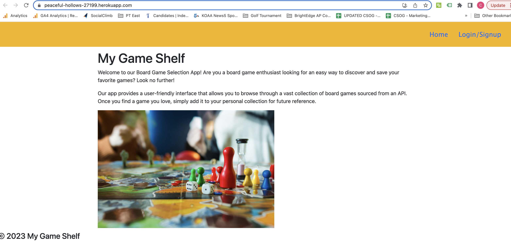
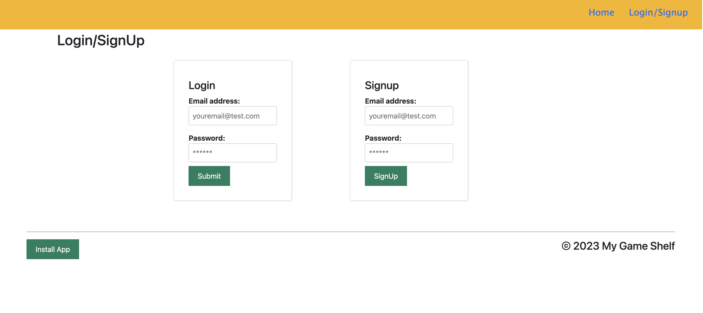
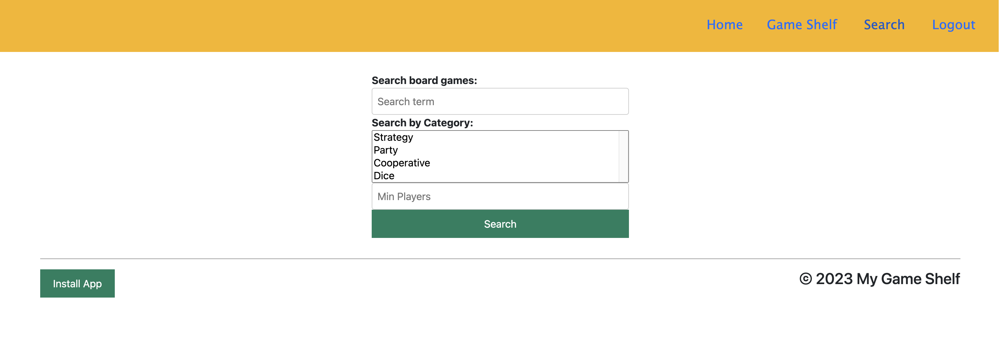
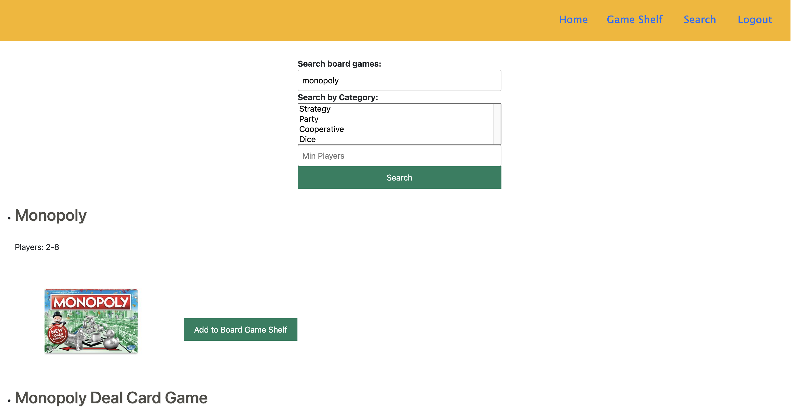

# MyGameShelf - the all in one game night planner

## Links

1. GitHub Repository: https://github.com/chelseyvalerio/mygameshelf
2. Heroku Deployed Application: https://peaceful-hollows-27199.herokuapp.com/

#

Behind every game night, there's a game night enthusiast looking to gather all their friends and family and cause healthy or not so healthy competitive drama amongst the group. We bring you the one stop shop to plan an epic game night full of laughter, jokes, and not easy to forget times with loved ones.

## User Story

As a User, I want to have my own account where I can search various types of games and add my favorites to my dashboard (MyGameShelf)

## Application Functionality

- When a user visits the app, user is prompted to login or sign up if a new user
- Once user is signed in, user can search games by way of category, or specific game name.
- Search results will display any number of games that qualify under user Input parameters.
- User can add any game(s) of their choosing to their MyGameShelf.
- When a user returns to their MyGameShelf, they view any and all games they have saved to their dashboard.

Summary:

User can access personal MyGameShelf Dashboard and quickly search:

- Category of game (eg board, digital, thinking, mystery, etc)
- Playing time
- Game Rating

Then user can store selected games to their personal MyGameShelf dashboard with one click

## Technologies Used:

- React
- GraphQL with Node.js and Express.js
- MongoDB and Mongoose ODM
- Queries and Mutations for data retrieval and updating
- Heroku
- JWT Authentication - through use of BoardGameAtlas OAuth & Bcrypt
- BoardGameAtlas API - JSON Web Token
- Nodemon
- Apollo-server
- Axios
- WebVitals

#

### Run Application

1. npm i
2. npm run seed
3. npm run build
4. npm run develop

#

## Preview Application

The following images will provide a preview into the apps functionality and user interactivity

Home Page - Login or Sign Up Page

MyGameShelf Search Page

MyGameShelf Search Page Results

## Future Developments

1. Search and filter MyGameShelf by various categories such as number of players, game type, etc
2. Delete Games from user's personal MyGameShelf
3. Create a full game night to include food, drink, theme, etc that all game night participants can view at account owners discretion

#

## Collaborators:

- Johnny McGown
- Jesus Salazar
- Katherine Reiner
- Chelsey Valerio
# boardgameshelf
